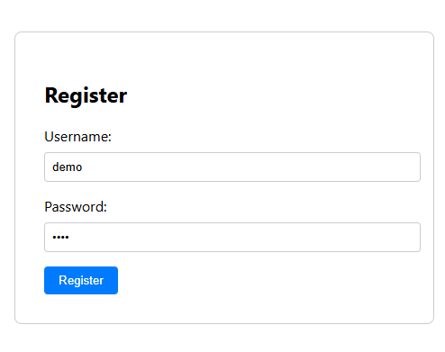
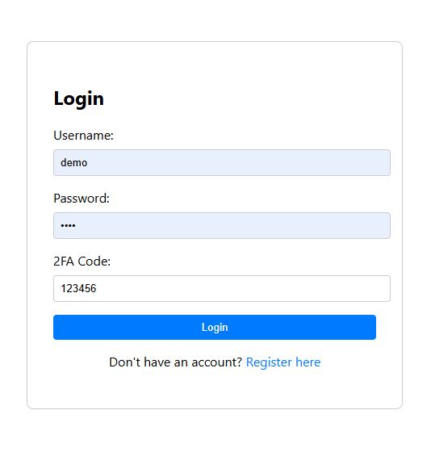

# 2FA Time-Based OTP Demo

This project demonstrates the implementation of a two-factor authentication (2FA) system using time-based one-time passwords (TOTP) in a web application. The application allows users to generate and verify TOTP codes, providing an extra layer of security for user accounts.

## Features

- User registration and login with 2FA enabled.
- Generation of TOTP codes based on a secret key.
- Verification of TOTP codes entered by the user.
- Integration with a backend server for user management and TOTP generation.
- User-friendly interface for generating and verifying TOTP codes.
- Secure storage of user data and TOTP secrets.
- Error handling and validation for user inputs.

## Technologies Used

- Frontend: Angular, HTML, CSS
- Backend: Node.js, Express.js
- Database: SqLite

## Screenshots





## Getting Started

To get started with this project, follow these steps:

1. Clone the repository: `git clone git@github.com:Ahmedgis/2FA-TOTP.git`  
2. Install the dependencies: `npm install`


This project was generated using [Angular CLI](https://github.com/angular/angular-cli) version 19.2.11.

## Development server

To start a local development server, run:

```bash
cd frontend
npm run start
```

Once the server is running, open your browser and navigate to `http://localhost:4200/`. The application will automatically reload whenever you modify any of the source files.


## Running the backend server

To run the backend server, run at project `ROOT`:

```bash
npm start
```
This will start the development backend server at `http://localhost:3001`

## Building

To build the project run:

```bash
npm run build
```

This will compile your project and store the build artifacts in the `dist/` directory. By default, the production build optimizes your application for performance and speed.

## Running unit tests

To execute unit tests with the [Karma](https://karma-runner.github.io) test runner, use the following command:

```bash
npm run test
```

## Running end-to-end tests

For end-to-end (e2e) testing, run:

```bash
ng e2e
```

Angular CLI does not come with an end-to-end testing framework by default. You can choose one that suits your needs.

## Additional Resources

For more information on using the Angular CLI, including detailed command references, visit the [Angular CLI Overview and Command Reference](https://angular.dev/tools/cli) page.
